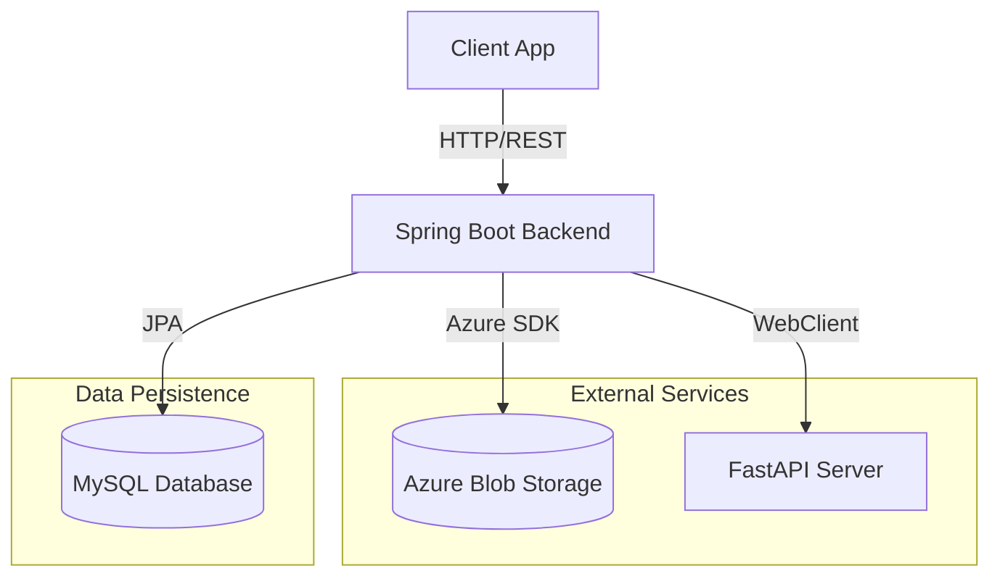
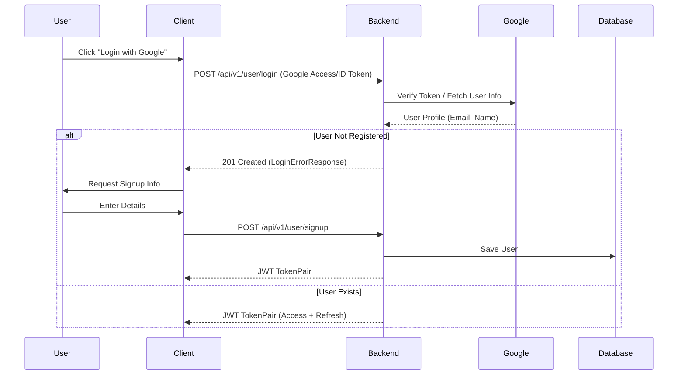
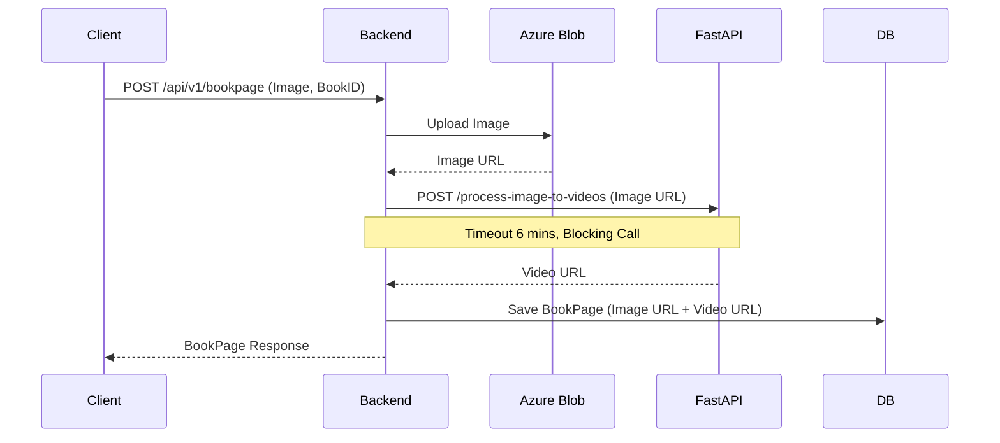

# Full Moon Backend Project

## 1. Project Overview
This project is the backend service for the "Full Moon" application. It manages users, children profiles, books, and book pages (including video generation from images).

### Tech Stack
-   **Language**: Java 17
-   **Framework**: Spring Boot 3.5.4
-   **Database**: MySQL
-   **Storage**: Azure Blob Storage
-   **External Service**: FastAPI (for AI Video Generation)
-   **Build Tool**: Gradle

---

## 2. Architecture

### High-Level Architecture


### Key Flows

#### 2.1 Authentication (Google OAuth & JWT)
Using Google OAuth2 for initial authentication, then issuing JWT Access/Refresh tokens.



#### 2.2 Book Page Creation (Image to Video)
The core feature where an uploaded image is converted to a video via an external AI service.



---

## 3. API Documentation

Swagger UI is available at: `http://localhost:8080/swagger-ui.html` (Local)
or `/swagger-ui/index.html`

### User Domain (`/api/v1/user`)
| Method | Endpoint | Description |
| :--- | :--- | :--- |
| `POST` | `/signup` | Register a new user with Google info. |
| `POST` | `/login` | Login with Google. Returns JWT. |
| `POST` | `/logout` | Logout (Invalidate Refresh Token). |
| `DELETE` | `/signout` | Delete user account. |

### Child Domain (`/api/v1/child`)
| Method | Endpoint | Description |
| :--- | :--- | :--- |
| `POST` | `/` | Create a child profile (Multipart: Image, Name). |
| `GET` | `/` | Get all children for the user. |
| `PATCH` | `/update` | Update child profile. |
| `DELETE` | `/` | Delete child profile. |

### Book Domain (`/api/v1/book`)
| Method | Endpoint | Description |
| :--- | :--- | :--- |
| `POST` | `/` | Create a book (Multipart: Cover Image, Title). |
| `GET` | `/` | Get random 3 books (Discovery). |
| `GET` | `/children/{childId}` | Get all books for a specific child. |
| `POST` | `/share` | Copy a friend's book to my child's library. |
| `DELETE` | `/` | Delete a book. |

### BookPage Domain (`/api/v1/bookpage`)
| Method | Endpoint | Description |
| :--- | :--- | :--- |
| `POST` | `/` | Add a page to a book. **Triggers Video Gen**. (Multipart: Image). |
| `GET` | `/` | Get all pages for a book. |
| `DELETE` | `/` | Delete a page. |

### Common Infrastructure (`/api/v1`)
| Method | Endpoint | Description |
| :--- | :--- | :--- |
| `POST` | `/s3` | **Legacy** S3 Upload (Consider using Azure). |

---

## 4. Configuration & Setup

You must provide the following environment variables or create `src/main/resources/application.yml` (or `.env` if loading from it).
See `.env.example` for a template.

### Required Environment Variables
| Variable | Description | Example |
| :--- | :--- | :--- |
| `spring.datasource.url` | MySQL JDBC URL | `jdbc:mysql://localhost:3306/fullmoon` |
| `spring.datasource.username` | Database Username | `root` |
| `spring.datasource.password` | Database Password | `password` |
| `spring.cloud.azure.storage.blob.endpoint` | Azure Blob Endpoint | `https://<account>.blob.core.windows.net` |
| `spring.cloud.azure.storage.blob.container-name` | Container Name | `images` |
| `fastapi.base-url` | URL of the AI Video Service | `http://localhost:8000` |
| `jwt.secret` | Secret key for JWT signing | `myverylongsecretkey...` |

### Running Locally
1.  **Database**: Ensure MySQL is running and the database is created.
    ```sql
    CREATE DATABASE fullmoon;
    ```
2.  **FastAPI**: Ensure the AI service is running at the configured URL.
3.  **Build & Run**:
    ```bash
    ./gradlew clean bootRun
    ```

---

## 5. Testing Guide

### 5.1 Using Swagger UI
1.  Run the application.
2.  Open `http://localhost:8080/swagger-ui/index.html` in your browser.
3.  Authenticate:
    -   Use the `User` > `/login` or `/signup` endpoint to get a token.
    -   Click "Authorize" and enter `Bearer <your_token>`.
4.  Test Endpoints:
    -   **Create Child**: Upload image to Azure via `/api/v1/child`.
    -   **Create Page**: Upload image to Azure, which triggers FastAPI for video.

### 5.2 Manual Testing Flow
1.  **Signup/Login**: Obtain a JWT token.
2.  **Setup Profile**: Create a Child profile (Image stored in Azure).
3.  **Create Content**: Create a Book.
4.  **Generate AI Video**: Add a Page. Verify response has Azure Image URL and Generated Video URL.
